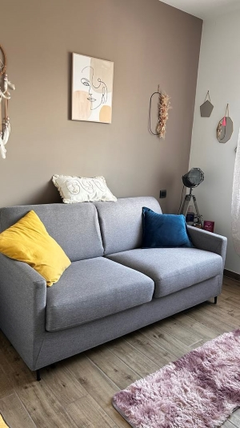
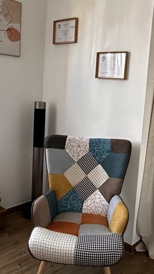
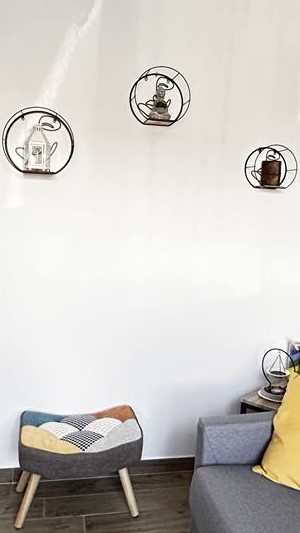

<div align ="center">
<h1 align="center">Bienvenue sur le Projet Patricia Deias 👋</h1>
<p align="center">
  
</p>

> Au cours de ma formation, j'ai entrepris un projet particulier qui consistait à créer un site web de présentation pour un client spécialisé dans l'accompagnement personnel et professionnel. Pour ce projet, j'ai utilisé React et Tailwind, technologies modernes qui permettent de réaliser des interfaces dynamiques et esthétiques.

### Que trouver :

<h1>💻 Aperçu du site 💻</h1>

  
    
      
      

### Page du site :

[patricia-deias.netlify.app](https://patricia-deias.netlify.app/)

# 💻 Tech Stack:


  

## Install

```sh
npm install
```

## Team en charge du 👤

<br>Ce projet est réalisé par moi-même et est encore en développement</br>

<p>Aurélien Chetot</p>


<p align="center">
  <a href="https://github.com/AurelienChetot">Aurélien Chetot</a>
</p>


<p align="center">
  <a href="https://www.linkedin.com/in/aur%C3%A9lien-chetot-6861852b2/">Aurélien Chetot</a>
</p>

[](mailto:your-email@gmail.com)

<p align="center">
  <a href="mailto:aurelien.chetot@gmail.com">Aurélien Chetot</a>
  <p>aurelien.chetot@gmail.com</p>
</p>

N'hésitez pas à me contacter via LinkedIn ou Mail pour toute question ou commentaire sur ce projet.
_This README was generated with ❤️ by [readme-md-generator](https://github.com/kefranabg/readme-md-generator)_
